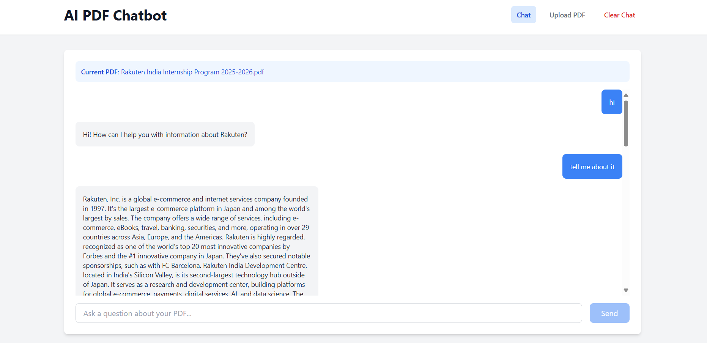
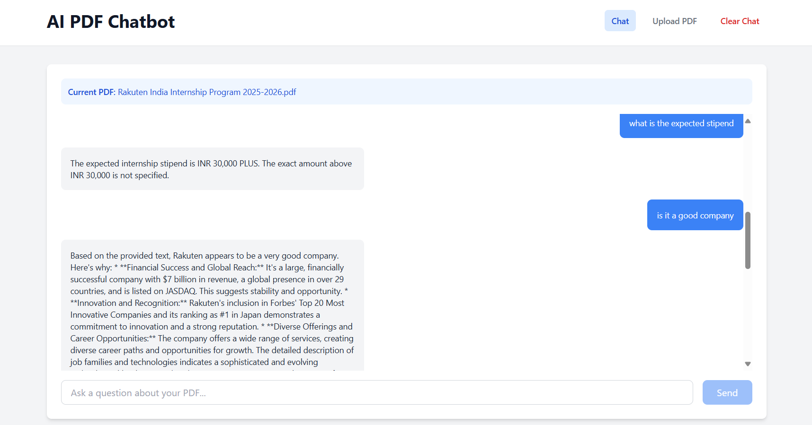

# AI PDF Chatbot with Gemini AI

A Retrieval-Augmented Generation (RAG) chatbot that allows you to chat with your PDF documents using Google's Gemini AI.

## Features

- Upload and process PDF documents
- Chat with your documents using AI
- Semantic search for relevant content
- Modern React frontend with Tailwind CSS
- Node.js backend with Express
- MongoDB for data storage
- Docker containerization

## Screenshots

### Upload PDF

### Chat with Document

## Prerequisites

- Node.js (v18 or higher)
- Docker and Docker Compose
- Gemini AI API key

## Setup

1. Clone the repository
2. Copy `.env` and configure your environment variables
3. Set your Gemini AI API key in the `.env` file
4. Run `docker-compose up -d` to start all services

## Environment Variables

### Backend
- `PORT`: Backend server port (default: 5000)
- `MONGODB_URI`: MongoDB connection string
- `GEMINI_API_KEY`: Your Gemini AI API key
- `JWT_SECRET`: Secret for JWT token generation
- `NODE_ENV`: Environment (development/production)

### Frontend
- `VITE_API_BASE_URL`: Backend API URL (default: http://localhost:5000/api)

## Usage

1. Access the application at http://localhost:3000
2. Upload PDF documents using the Upload tab
3. Switch to the Chat tab to ask questions about your documents
4. The AI will respond based on the content of your uploaded PDFs

## API Endpoints

- `POST /api/upload` - Upload a PDF file
- `POST /api/chat` - Send a message to the chatbot
- `GET /api/chat/:chatId` - Get chat history
- `GET /api/health` - Health check endpoint

## Deployment

### Docker Deployment
1. Set up your environment variables in `.env`
2. Run `docker-compose up -d` to start the application
3. The application will be available at http://localhost:3000

### Manual Deployment
1. Install dependencies: `npm install` in both frontend and backend directories
2. Start MongoDB service
3. Set environment variables
4. Start backend: `npm start` in backend directory
5. Start frontend: `npm run dev` in frontend directory

## Technologies Used

- Frontend: React, Vite, Tailwind CSS
- Backend: Node.js, Express
- AI: Google Gemini AI
- Database: MongoDB
- File Upload: Multer
- Containerization: Docker

## License

This project is licensed under the MIT License.